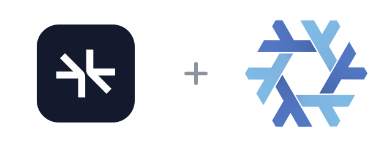

<p align="center">
  
</p>

<h1 align="center">supermemory-flake</h1>

<p align="center">
  <a href="flake.nix"></a>
  <a href="LICENSE"></a>
  <a href="https://github.com/supermemoryai/supermemory/releases/tag/server-v0.0.8"></a>
</p>

[Supermemory](https://supermemory.ai) is a memory API for AI agents: it stores what they learn and finds it again with hybrid search.

This flake packages the official self-hosted server binary for Nix and runs it as a service, so coding agents on your machines can share one memory store you host yourself. It supports x86_64 and ARM64 Linux.

```sh
nix run github:Fractal-Tess/supermemory-flake
```

The first start prints the URL and a generated API key.

## Run it as a service

Add the flake input:

```nix
inputs.supermemory-flake.url = "github:Fractal-Tess/supermemory-flake";
```

Use the NixOS module (a system service with its own user) or the Home Manager module (a user service):

```nix
{
  imports = [ inputs.supermemory-flake.nixosModules.default ];

  services.supermemory-server = {
    enable = true;
    port = 6767;
    firewallInterfaces = [ "wt0" ];                 # NixOS only
    environment.OPENAI_BASE_URL = "http://localhost:11434/v1";
    environment.OPENAI_MODEL = "gpt-oss:20b";
    environmentFile = "/run/secrets/supermemory.env"; # OPENAI_API_KEY=...
  };
}
```

The server needs one LLM for memory extraction: OpenAI, Anthropic, Gemini, Groq, or any OpenAI-compatible endpoint. Embeddings run locally by default. See the [upstream configuration reference](https://supermemory.ai/docs/self-hosting/configuration) for every variable.

Data and the generated API key live in `/var/lib/supermemory` (NixOS) or `~/.local/share/supermemory` (Home Manager). Read the key from the `api-key` file there.

## Before you expose it

- The 0.0.8 server listens on every interface and trusts unauthenticated requests from localhost. Keep the port closed, or open it only on a private interface with `firewallInterfaces`.
- Telemetry is turned off by default here. Set `telemetry = true` to leave it on.
- The binary is closed source and free up to 10,000 documents under upstream's lite license. The package is marked unfree; the flake allows that one package for you.

## Connect Claude Code

Install the [Supermemory plugin](https://supermemory.ai/docs/integrations/claude-code), then point it at your server:

```sh
export SUPERMEMORY_API_URL="http://your-host:6767"
export SUPERMEMORY_CC_API_KEY="sm_..."
```

### Memory tools (MCP)

The plugin's search and save tools talk MCP, which the self-hosted server does not serve. Set `services.supermemory-server.mcp.enable = true` to run a small MCP endpoint next to it (port 6768), then add:

```sh
export SUPERMEMORY_MCP_URL="http://your-host:6768/mcp"
```

It provides `search_memory`, `add_memory`, `listDocuments`, and `whoAmI`, and passes your API key straight through to the server.

## Update

The daily [update workflow](.github/workflows/update.yml) checks the latest stable `server-v*` release, refreshes both Linux hashes, builds the package, and commits a validated update. Run the same process locally with:

```sh
./scripts/update.sh
```

Pass a version such as `./scripts/update.sh 0.0.8` to pin a specific release.

## Credits

[GitHub](https://github.com/Fractal-Tess/supermemory-flake)

The flake packaging is [MIT](LICENSE). The Supermemory server binary is proprietary software from [Supermemory](https://supermemory.ai); this project is not affiliated with or endorsed by them.

The logo combines the [Supermemory mark](https://github.com/supermemoryai/supermemory/blob/main/apps/docs/logo/dark.svg) ([MIT](https://github.com/supermemoryai/supermemory/blob/main/LICENSE)) with the [Nix snowflake](https://github.com/NixOS/nixos-artwork/tree/master/logo) by Simon Frankau and Tim Cuthbertson ([CC BY 4.0](https://creativecommons.org/licenses/by/4.0/)), resized and arranged here on a plain tile.
